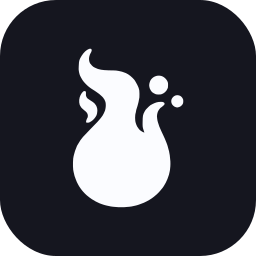

<div align="center">



# Wisp Privacy Test

**A small, sponsor-free ad blocker / tracker test.**
See if your blocker, DNS filter, or VPN catches ads, trackers, and analytics.

[](https://creativecommons.org/licenses/by-nc-sa/4.0/)
[](https://github.com/Turtlecute33/adblocktest)

<br />

<a href="https://orellius.github.io/wisp-adblock-test/">
  
</a>

<br />

</div>

---

## What this is

The privacy test bundled with the **Wisp** browser, used to show how much of
the ad/tracker surface the browser blocks out of the box. It probes a list of
known ad, analytics, and tracker hostnames from the page and scores how many
are blocked, plus cosmetic-filter and script-loading checks. No real ads or
trackers are ever activated.

## Changes from upstream

This is a fork of [Turtlecute33/adblocktest](https://github.com/Turtlecute33/adblocktest)
(itself a fork of [d3ward/toolz](https://github.com/d3ward/toolz)), modified by Wisp to:

- remove the IVPN sponsor banner (sponsor-free),
- remove the third-party umami analytics script (no tracker on a privacy
  test page),
- rebrand to Wisp (mark, names, metadata, deploy host).

## Credits & license

Original work by **d3ward** and **Turtlecute** (with **Daniela Brozzoni**).
Licensed under [CC BY-NC-SA 4.0](https://creativecommons.org/licenses/by-nc-sa/4.0/);
this fork keeps that license and attribution. Non-commercial use only.

## Build

```
npm ci
npm run build   # outputs to dist/
npm run dev     # local dev server
```
